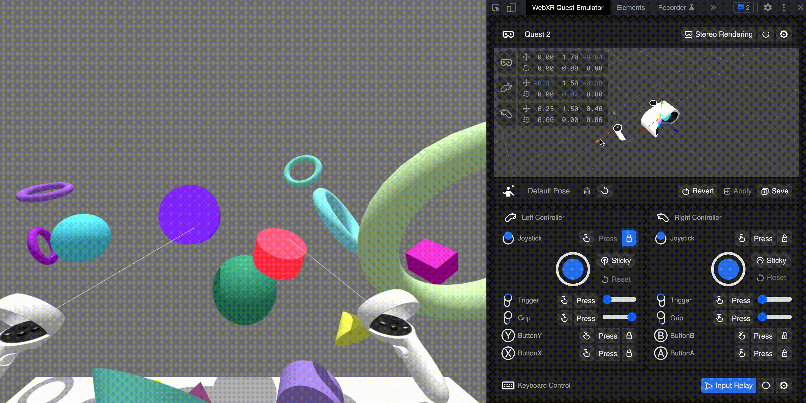
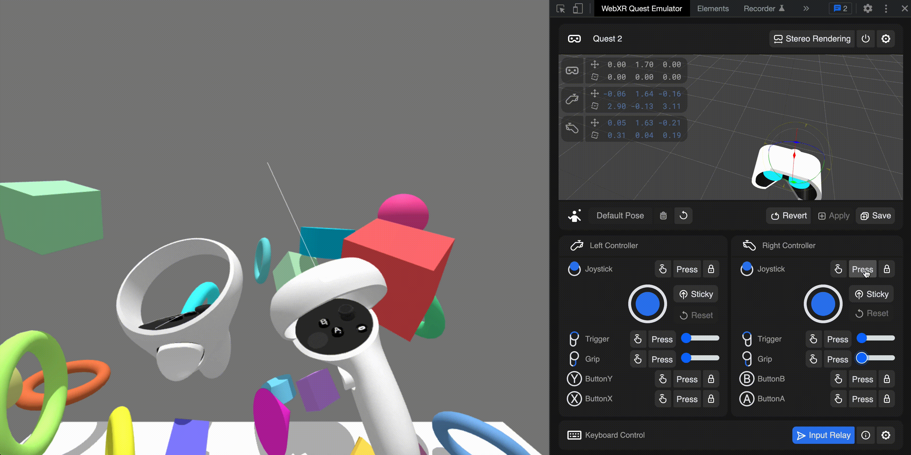

# WebXR Quest Emulator

WebXR Quest Emulator is a browser extension which helps your WebXR content creation. It enables you to responsively run [WebXR](https://www.w3.org/TR/webxr/) applications on your **desktop** browser without the need of any XR devices.
Inspired by the [official WebXR Emulator Extension by Mozilla Reality](https://github.com/MozillaReality/WebXR-emulator-extension) and our previous attempt of extending it for better functionality, WebXR Quest Emulator is designed and rebuilt from the ground up with an emphasis on **full input emulation** (including touch and analog input), **better usability** (re-engineered UI) and **pro features** (Keyboard and gamepad input mirroring) specifically for Quest devices.

## Features

- [WebXR API polyfill](https://github.com/immersive-web/webxr-polyfill)
- 6DOF Transform control for headset, left and right controllers, powered by [Three.js](https://threejs.org/)
- Full input emulation support for Oculus Touch controllers
- External input mirroring support for both keyboard and gamepad
- Cross browsers support with [WebExtensions API](https://developer.mozilla.org/en-US/docs/Mozilla/Add-ons/WebExtensions)

## Installation

This extension is built on top of [WebExtensions API](https://developer.mozilla.org/en-US/docs/Mozilla/Add-ons/WebExtensions). It works on Firefox, Chrome, and other browsers supporting the API.
The WebXR Quest Emulator is still a work in progress. We plan to publish it on the Chrome and Firefox extension stores once we get to feature complete, but for now you need to download/clone the extension source code to local and load the unpacked extension to use it.

### Installing on Chrome

Chrome's official guide for loading an unpacked extension can be found [here](https://developer.chrome.com/docs/extensions/mv3/getstarted/#unpacked). Here is a quick list of steps copied from their guide:

1. Open the Extension Management page by navigating to chrome://extensions.
2. Enable Developer Mode by clicking the toggle switch next to Developer mode.
3. Click the Load unpacked button and select the extension directory (the WebXRQuestEmulator folder that you cloned/downloaded).

### Installing on Firefox

Firefox's official guide for loading an unpacked extension can be found [here](https://extensionworkshop.com/documentation/develop/temporary-installation-in-firefox/). Here is a quick list of steps copied from their guide:

1. enter "about:debugging" in the URL bar
2. click "This Firefox"
3. click "Load Temporary Add-on"
4. open the extension's directory and select any file inside the extension (e.g. manifest.json in the WebXRQuestEmulator folder that you cloned/downloaded).

### Installing on Edge

Edge's official guide for loading an unpacked extension can be found [here](https://learn.microsoft.com/en-us/microsoft-edge/extensions-chromium/getting-started/extension-sideloading). Here is a quick list of steps copied from their guide:

1. Open the Extension Management page by navigating to edge://extensions.
2. Enable Developer Mode by clicking the toggle switch next to Developer mode.
3. Click the Load unpacked button and select the extension directory (the WebXRQuestEmulator folder that you cloned/downloaded).

## Usage

After successfully installing the emulator

1. Go to WebXR application page (for example [WebXR examples](#WebXR-examples)). You will notice that the application detects that you have a XR device (emulated) and it will let you enter the immersive VR mode.

2. Open "WebXR Quest Emulator" tab in the browser developer tool ([Firefox](https://developer.mozilla.org/en-US/docs/Tools), [Chrome](https://developers.google.com/web/tools/chrome-devtools/)) to controll the emulated devices. You can move the headset and controllers, and trigger the controller buttons. You will see their transforms reflected in the WebXR application.

### Device Nodes Transform Controls

By clicking a device node in the emulator's 3D viewport, you can select gizmo mode of the device. By dragging a gizmo, you can rotate or translate the device. Alternatively, you can use the following keyboard shortcut to cycle through gizmo modes of the different device nodes:

| Device Node      | Keyboard Binding |
| ---------------- | ---------------- |
| Headset          | Number Key 1     |
| Left Controller  | Number Key 2     |
| Right Controller | Number Key 3     |

### Oculus Touch Controller Emulated Controls

| Button Action   | Description                                                                                    |
| --------------- | ---------------------------------------------------------------------------------------------- |
| Touch           | Toggle [GamepadButton](https://developer.mozilla.org/en-US/docs/Web/API/GamepadButton).touched |
| Press           | Set GamepadButton.pressed to true and revert after 0.25 seconds                                |
| Lock            | Toggle [GamepadButton](https://developer.mozilla.org/en-US/docs/Web/API/GamepadButton).pressed |
| Joystick        | Set values on [Gamepad.axes](https://developer.mozilla.org/en-US/docs/Web/API/Gamepad/axes)    |
| Joystick-Sticky | Toggle the auto-return feature of the emulated joystick                                        |
| Joystick-Reset  | Recenter the emulated joystick                                                                 |
| Slider          | Emulate analog input for trigger and grip                                                      |

### Stereo Effect

You can enable/disable Stereo Effect which renders two views.

### Pose Controls

> :warning: **This feature is still a work-in-progress.**

You can save/load/delete combinations of device node transforms.

### Keyboard Control & Events Pass-Through (Alpha)

> :warning: **This feature is still a work-in-progress.**

There are keyboard mapping built in for some important controller emulated controls:

| Button Action        | Keyboard Binding |
| -------------------- | ---------------- |
| Left Joystick        | W/A/S/D          |
| Left Joystick Click  | C                |
| Button X             | X                |
| Button Y             | Z                |
| Left Trigger         | E                |
| Left Grip            | Q                |
| Right Joystick       | Arrow Keys       |
| Right Joystick Click | .                |
| Button A             | '                |
| Button B             | /                |
| Right Trigger        | Enter            |
| Right Grip           | Shift            |

Keyboard events other than those reserved for controller emulation are passed through to the main WebXR experience, you may wish to utilize this feature to build in some shortcuts for debugging purposes.

### Gamepad Control (Pre-Alpha)

> :warning: **This feature is still a work-in-progress.**

There are XBox Controller mapping built in for some important controller emulated controls as well as device nodes transform controls. The bindings are for one device node at a time, you can cycle through device nodes with the XBox button:

| Button Action          | Gamepad Binding                                 |
| ---------------------- | ----------------------------------------------- |
| Joystick               | Right Joystick (click + slide)                  |
| Trigger                | Right Trigger                                   |
| Grip                   | Left Trigger                                    |
| Button A/X             | Button A                                        |
| Button B/Y             | Button B                                        |
| Device Position X Axis | Left Joystick slide left/right                  |
| Device Position Z Axis | Left Joystick slide forward/backward            |
| Device Position Y Axis | DPad Up/Down                                    |
| Device Rotation X Axis | Button X + Left Joystick slide left/right       |
| Device Rotation Z Axis | Button X + Left Joystick slide forward/backward |
| Device Rotation Y Axis | Button X + DPad Up/Down                         |

## Note

- Even if native WebXR API is available the extension overrides it with WebXR polyfill

## WebXR examples

- [WebXR Samples](https://immersive-web.github.io/webxr-samples/)
- [Three.js WebXR VR examples](https://threejs.org/examples/?q=WebXR#webxr_vr_ballshooter)
- [Babylon.js WebXR examples](https://doc.babylonjs.com/how_to/webxr_demos_and_examples)
- [A-Frame](https://aframe.io/)
