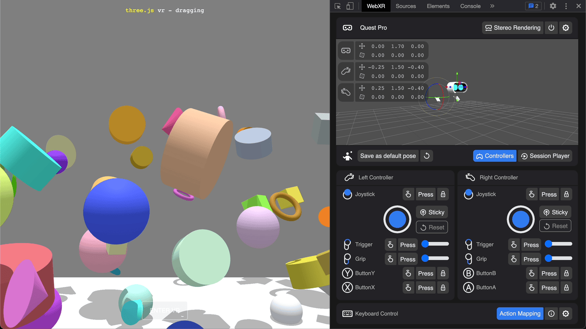
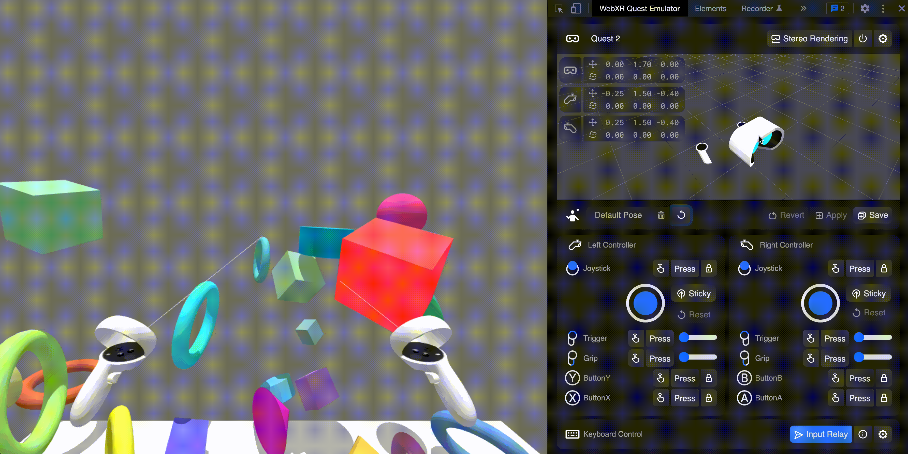
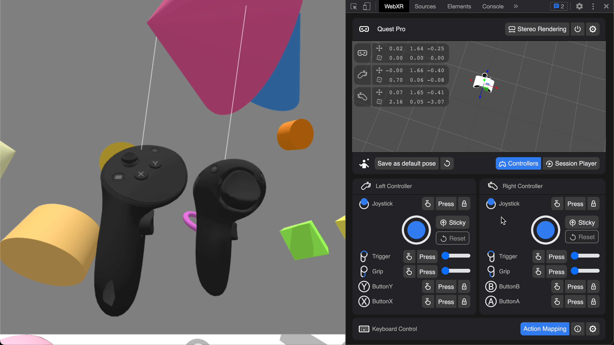
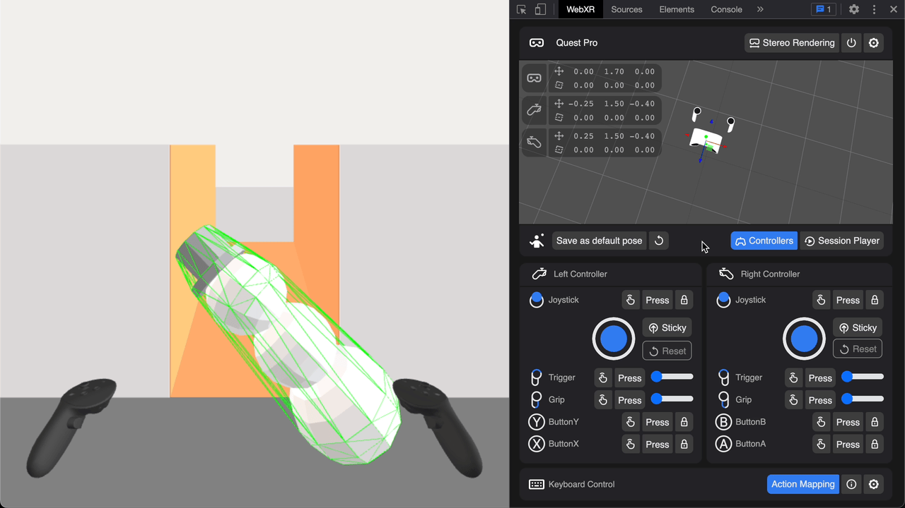

Immersive Web Emulator is a browser extension that assists WebXR content creation. It enables developers to responsively run [WebXR](https://www.w3.org/TR/webxr/) apps on a desktop browser without the need of an XR device.

Inspired by the [official WebXR Emulator Extension by Mozilla Reality](https://github.com/MozillaReality/WebXR-emulator-extension/) and our previous efforts of extending it for better functionality, Immersive Web Emulator is designed and rebuilt from the ground up with an emphasis on full input emulation (including touch and analog input), better usability with a re-engineered UI, and more features, such as keyboard input mirroring and input session recording/playback, specifically for Meta Quest headsets.

## Immersive Web Emulator Features

- [WebXR API polyfill](https://github.com/immersive-web/webxr-polyfill)
- 6DOF transform control for the headset and left and right controllers, powered by [Three.js](https://threejs.org/)
- Full input emulation support for Meta Quest Touch controllers
- External input mirroring support for both keyboard and gamepad
- Cross browsers support with [WebExtensions API](https://developer.mozilla.org/en-US/docs/Mozilla/Add-ons/WebExtensions/)

## Installation

This extension is built on [WebExtensions API](https://developer.mozilla.org/en-US/docs/Mozilla/Add-ons/WebExtensions) and implements [Manifest V3](https://developer.chrome.com/docs/extensions/mv3/intro/). It works on Chrome, Microsoft Edge, and other browsers that support the API. The immersive Web Emulator can be installed from the following browser extension stores:

- [Google Chrome Web Store Page](https://chrome.google.com/webstore/detail/immersive-web-emulator/cgffilbpcibhmcfbgggfhfolhkfbhmik)
- [Microsoft Edge Add-ons Store Page](https://microsoftedge.microsoft.com/addons/detail/immersive-web-emulator/hhlkbhldhffpeibcfggfndbkfohndamj)

### Manual Installation

For other Chromium-based browsers, you can download our latest release, and try to manually install the extension by:

1. Download the latest release [here](https://github.com/meta-quest/immersive-web-emulator/releases), unpack it and note the unpacked directory.
2. Open the Extensions page of the browser, it can typically be found in the browser menu, or you can try navigating to "chrome://extensions" in the URL bar if the browser is Chromium-based.
3. Locate and Enable **developer mode** on the Extensions page.
4. Locate and click on the **Load unpacked button** and select the unpacked directory from step 1.

The process may vary for different browsers.

## Immersive Web Emulator Usage

After successfully installing the emulator, do the following to use Immersive Web Emulator:

1. Go to a WebXR app page (for example, see the [WebXR Examples](#WebXR-Examples)). Notice that the app detects an XR device (emulated) and allows you to enter the immersive VR mode.
2. Open the **Immersive Web Emulator** tab by going to the Chrome settings button and selcting **More tools** > **Developer tools** and looking for it on the tab bar at the top of the screen. You might need to click **>>** if there are many tabs. From there, you can control the emulated devices. You can move the headset and controllers, and trigger the controller buttons. You can see their transforms reflected in the WebXR application. Note that the **Immersive Web Emulator** tab is only available on WebXR app pages.

### Device Nodes Transform Controls

By clicking a device node in the emulator's 3D viewport, you can select gizmo mode of the device. By dragging a gizmo, you can rotate or translate the device. Alternatively, you can use the following keyboard shortcut to cycle through gizmo modes of the different device nodes:

| Device Node      | Keyboard Binding |
| ---------------- | ---------------- |
| Headset          | Number Key 1     |
| Left Controller  | Number Key 2     |
| Right Controller | Number Key 3     |

### Meta Touch Controller Emulated Controls

| Button Action   | Description                                                                                       |
| --------------- | ------------------------------------------------------------------------------------------------- |
| Touch           | Toggle '[GamepadButton](https://developer.mozilla.org/en-US/docs/Web/API/GamepadButton).touched'. |
| Press           | Set 'GamepadButton.pressed' to true and revert after 0.25 seconds.                                |
| Lock            | Toggle '[GamepadButton](https://developer.mozilla.org/en-US/docs/Web/API/GamepadButton).pressed'. |
| Joystick        | Set values on '[Gamepad.axes](https://developer.mozilla.org/en-US/docs/Web/API/Gamepad/axes)'.    |
| Joystick-Sticky | Toggle the auto-return feature of the emulated joystick.                                          |
| Joystick-Reset  | Recenter the emulated joystick.                                                                   |
| Slider          | Emulate analog input for trigger and grip.                                                        |

### Stereo Effect

You can enable/disable Stereo Effect which renders two views.

### Pose Controls

You can save an arbitrary combination of device nodes transform data as the default starting pose of the emulator.

### Keyboard Control & Events Pass-Through

There are keyboard mapping built in for some important controller emulated controls:

| Button Action        | Keyboard Binding |
| -------------------- | ---------------- |
| Left Joystick        | W/A/S/D          |
| Left Joystick Click  | C                |
| Button X             | X                |
| Button Y             | Z                |
| Left Trigger         | E                |
| Left Grip            | Q                |
| Right Joystick       | Arrow Keys       |
| Right Joystick Click | .                |
| Button A             | '                |
| Button B             | /                |
| Right Trigger        | Enter            |
| Right Grip           | Shift            |

Keyboard events other than those reserved for controller emulation are passed through to the main WebXR experience, you may wish to utilize this feature to build in some shortcuts for debugging purposes.

<!-- ### Record Session & Emulator Playback

You can also use the session recording utility package to record input sessions from your WebXR experiences in headset, and replay the input session with the emulator -->

## Note

- Even if native WebXR API is available the extension overrides it with WebXR polyfill

## WebXR Examples

- [WebXR Samples](https://immersive-web.github.io/webxr-samples/)
- [Three.js WebXR VR examples](https://threejs.org/examples/?q=WebXR#webxr_vr_ballshooter)
- [Babylon.js WebXR examples](https://doc.babylonjs.com/features/featuresDeepDive/webXR/webXRDemos)
- [A-Frame](https://aframe.io/)

## Contributing

See the [CONTRIBUTING](CONTRIBUTING.md) file for how to help out.

## License

Immersive Web Emulator is MIT licensed, as found in the [LICENSE](LICENSE.md) file.
